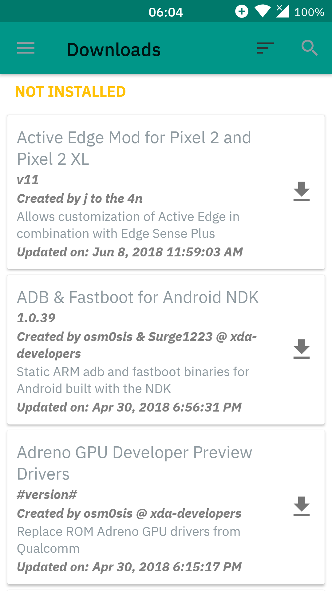

# IBM Plex™ font Magisk Module
## original font repo:
## https://github.com/IBM/plex

# Testing devices:
* OnePlus X with LineageOS 14.1 (Android 7.1.2)

* Galaxy Tab Pro 8.4 (a.k.a. mondrianwifi/SMT-320) with LineageOS 13.0 (Android 6.0.1)

# Known issue:
* The colon in the lockscreen clock seems like it is missing and shows up as a unknown unicode block symbol.

# Changelog:
* 1.0: *initial release*

# Screenshot

